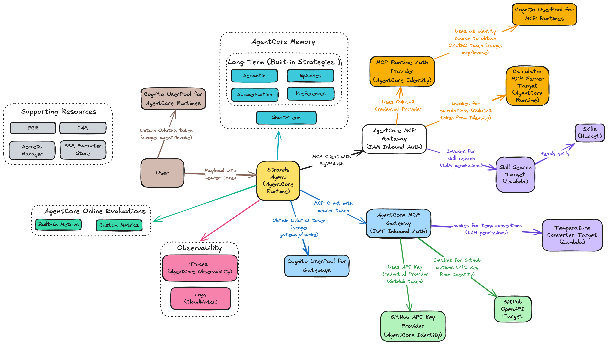

# AgentCore CDK

## Architecture



The diagram shows the complete authentication and data flow, including:
- Cognito UserPools for authentication (Agent Runtimes, Gateways, MCP Runtimes)
- AgentCore MCP Gateways (IAM and JWT authentication)
- AgentCore Identity with OAuth2 and API Key credential providers
- MCP targets (Calculator Runtime, Skill Search Lambda, Temperature Converter Lambda, GitHub OpenAPI)
- Observability components (Traces, Evaluations, CloudWatch Logs)
- AgentCore Memory for short-term and long-term conversation memory (Summary, Preference, Semantic, and Episodic strategies)
- Skills S3 bucket

[View editable diagram](docs/architecture.excalidraw)

## Project Structure

```
.
├── app.py                        # CDK application entry point
├── pyproject.toml                # Python project dependencies
├── Makefile                      # Main Makefile (includes sub-makefiles)
├── pytest.ini                    # Pytest configuration
│
├── makefiles/                    # Modular Makefile organisation
│   ├── setup.mk                  # Setup and installation commands
│   ├── config.mk                 # Configuration validation
│   ├── code-quality.mk           # Linting and formatting
│   ├── cdk.mk                    # CDK deployment commands
│   ├── users.mk                  # Cognito user management (create, list)
│   ├── infrastructure-tests.mk   # Pytest infrastructure tests
│   ├── manual-tests.mk           # Manual testing scripts
│   ├── observability.mk          # Observability dashboard commands
│   └── convenience.mk            # Convenience targets
│
├── config/                       # Environment-specific configurations
│   ├── dev.yaml                  # Development environment settings
│   ├── test.yaml                 # Test environment settings
│   └── prod.yaml                 # Production environment settings
│
├── src/
│   ├── cdk/                      # CDK infrastructure code
│   │   ├── config.py             # Configuration loader (type-safe YAML parsing)
│   │   ├── stacks/               # CloudFormation stacks
│   │   │   └── agentcore.py      # Main AgentCore stack (gateways, runtimes, memory, evals, observability, and MCP targets)
│   │   ├── constructs/           # Reusable L3 constructs
│   │   │   ├── cognito.py        # Cognito user pools and app clients
│   │   │   ├── gateway.py        # AgentCore Gateways
│   │   │   ├── runtime.py        # AgentCore Runtimes
│   │   │   ├── identity.py       # Credential providers (OAuth2, API keys) in AgentCore Identity
│   │   │   ├── evaluation.py     # Online evaluation configurations for runtime monitoring
│   │   │   ├── custom_evaluator.py # Custom evaluators with configurable models, prompts, and scoring
│   │   │   ├── memory.py         # AgentCore Memory with Summary, Preference, Semantic, and Episodic strategies
│   │   │   ├── bucket.py         # S3 buckets with lifecycle policies (store skills)
│   │   │   └── gateway_targets/  # Gateway target configurations
│   │   │       ├── lambda_.py    # Lambda function targets
│   │   │       ├── mcp_server.py # MCP server targets
│   │   │       └── open_api.py   # OpenAPI targets
│   │   └── utils/                # Utility functions
│   │       ├── cleanup.py        # Log group cleanup aspects and custom resources
│   │       └── strings.py        # Case conversion utilities (kebab/PascalCase/snake_case)
│   │
│   ├── common/                   # Shared utilities
│   │   └── logger.py             # Structured logging module (shared across Agent and MCP targets)
│   │
│   ├── agent/                    # Agent runtime implementation (modular Python structure)
│   │   ├── main.py               # Minimal entry point and orchestration
│   │   ├── config.py             # Configuration management with lazy loading
│   │   ├── agent_handler.py      # Core agent invocation logic
│   │   ├── pyproject.toml        # Agent dependencies
│   │   ├── Dockerfile            # Agent container image
│   │   ├── auth/                 # Authentication modules
│   │   │   ├── cognito.py        # OAuth2 token management for JWT gateway
│   │   │   └── sigv4.py          # AWS SigV4 authentication for IAM gateway
│   │   ├── gateway/              # MCP client management
│   │   │   └── clients.py        # MCP client setup and tool aggregation
│   │   ├── prompts/              # System prompt management
│   │   │   ├── system_prompt.md  # Base system prompt (markdown format)
│   │   │   └── loader.py         # Load and compose system prompts
│   │   └── skills/               # Skills loading from S3
│   │       └── loader.py         # Extract and format skill definitions for system prompt
│   │
│   ├── evals/                    # Custom evaluator definitions
│   │   ├── math_accuracy.py      # Calculator operation validation
│   │   ├── temperature_conversion.py # Temperature formula validation
│   │   ├── skill_workflow.py     # Skill completeness checking
│   │   ├── github_integrity.py   # Data hallucination detection
│   │   └── output_format.py      # Output format validation
│   │
│   ├── mcp/                      # MCP server implementations
│   │   ├── calculator/           # Basic calculator MCP server (MCP Server Target)
│   │   │   ├── main.py           # FastMCP server with arithmetic tools
│   │   │   ├── pyproject.toml    # Server dependencies (fastmcp)
│   │   │   └── Dockerfile        # Container image for Runtime deployment
│   │   ├── temperature_converter/ # Temperature conversion MCP server (Lambda Target)
│   │   │   ├── main.py           # FastMCP server with temp conversion tools
│   │   │   ├── schema.json       # Schema for Gateway integration
│   │   │   └── Dockerfile        # Container image for Runtime deployment
│   │   ├── skill_search/         # Skill search MCP server (Lambda Target)
│   │   │   ├── main.py           # FastMCP server with skill search tools
│   │   │   ├── schema.json       # Schema for Gateway integration
│   │   │   └── Dockerfile        # Container image for Runtime deployment
│   │   └── github/               # GitHub API MCP server (OpenAPI Target)
│   │       └── schema.json       # GitHub OpenAPI schema for Gateway target
│   │
│   ├── observability/            # Observability dashboard and setup
│   │   ├── backend/              # Flask API (CloudWatch Logs queries, OTEL span parsing)
│   │   ├── frontend/             # React + Cloudscape UI (trace visualisation)
│   │   ├── run.py                # Dashboard launcher
│   │   └── setup.sh              # One-time account setup for AgentCore observability (X-Ray tracing)
│   │
│   └── skills/                   # Agent skill definitions
│       ├── issue_heat_map.md
│       ├── portfolio_summary.md
│       ├── repo_comparison.md
│       ├── repo_hotness_rating.md
│       └── trending_topic_scout.md
│
├── layers/                       # Lambda layer source directories
│   └── agentcore_sdk/            # AgentCore Starter Toolkit SDK layer (bundled at deploy time)
│
├── scripts/                      # Utility scripts
│   ├── create_user.py            # Create Cognito users for agent authentication
│   └── list_users.py             # List all users in Cognito User Pool
│
└── tests/                        # Tests and manual invocation scripts
    ├── common/                   # Shared test utilities
    │   └── auth/                 # Authentication modules (IAM SigV4, JWT OAuth2, Cognito user validation)
    │       ├── iam.py            # SigV4 auth for IAM gateway
    │       ├── jwt.py            # OAuth2 auth for JWT gateway
    │       └── cognito_user.py   # Cognito user validation (lookup by preferred_username)
    ├── infrastructure/           # Automated infrastructure tests (pytest)
    │   ├── memory/               # Memory service validation
    │   │   ├── conftest.py       # Shared fixtures (test-user, memory_id, etc.)
    │   │   ├── test_memory_create.py  # Create memory events
    │   │   ├── test_memory_queries.py # Query memory records
    │   │   └── test_memory_view.py    # View stored memories
    │   ├── gateways/             # Gateway deployment validation
    │   │   ├── conftest.py       # Shared fixtures (gateway URLs, test-user)
    │   │   ├── test_iam_auth.py  # IAM SigV4 authentication tests
    │   │   ├── test_jwt_auth.py  # JWT OAuth2 authentication tests
    │   │   ├── test_tool_invocation.py # End-to-end tool invocation
    │   │   └── test_error_handling.py  # Error scenarios
    │   └── runtimes/             # Runtime deployment validation
    │       ├── conftest.py       # Shared fixtures (runtime ARNs, test-user)
    │       ├── test_agent_invocation.py   # Agent orchestration tests
    │       ├── test_mcp_invocation.py     # MCP runtime tests
    │       └── test_performance.py        # Basic performance benchmarks
    └── manual/                   # Manual testing and invocation scripts
        ├── runtimes/
        │   ├── agent/            # Agent runtime testing
        │   │   ├── invoke_agent.py   # Invoke agent with OAuth2 authentication (single prompt)
        │   │   ├── chat_client.py    # Interactive chat client for continuous conversation
        │   │   └── skill_tests/  # Test scripts for each agent skill
        │   └── mcp/              # MCP runtime testing
        │       └── invoke_calculator.py # Calculator runtime invocation
        ├── gateways/
        │   ├── iam/              # IAM-authenticated gateway testing
        │   │   ├── list_tools.py # List available tools
        │   │   ├── search_tools.py # Search tools by keyword
        │   │   ├── invoke_tool.py # Invoke a specific tool
        │   │   └── mcp_tests/    # MCP tools tests
        │   │       ├── calculator.py # Test calculator tools
        │   │       └── skill_search.py # Test skill search tool
        │   └── jwt/              # JWT-authenticated gateway testing
        │       ├── list_tools.py # List available tools
        │       ├── search_tools.py # Search tools by keyword
        │       ├── invoke_tool.py # Invoke a specific tool
        │       └── mcp_tests/    # MCP tools tests
        │           ├── github.py # Test GitHub tools
        │           └── temperature_converter.py # Test temperature converter tools
        ├── memory/               # Memory utility
        │   └── view_memory.py    # View memory records for an actor
        └── evaluations/          # Evaluation utilities
            ├── list_evals.py     # List online evaluation configurations
            └── query_results.py  # Query evaluation results
```

## Prerequisites

- Python 3.12 or higher
- AWS CLI configured with appropriate credentials and an active session
  ```bash
  # Verify your AWS session is active
  aws sts get-caller-identity
  ```
- AWS CDK CLI installed (`npm install -g aws-cdk`)
- AWS account bootstrapped for CDK
  ```bash
  # Bootstrap your AWS account (one-time per account/region)
  cdk bootstrap aws://AWS_ACCOUNT_ID/REGION_NAME --context env=dev

## Quick Start

### 1. Configure Environment and Stack Settings

#### Environment Variables

Copy the example environment file and update it with your values:

```bash
cp .env.example .env
```

Edit `.env` and set:
- `ENV` - Deployment environment (e.g., `dev`, `test`, `prod`) - defaults to `dev` if not set
- `AWS_ACCOUNT_ID` - Your AWS account ID (e.g., `123456789012`)
- `REGION_NAME` - AWS region where resources will be deployed (e.g., `ap-southeast-2`)
- `GITHUB_TOKEN` - Your GitHub personal access token (for GitHub MCP server)
- `ACTOR_ID` - Your username for Cognito user creation (e.g., `actor-123`) - used for agent chat identity and memory
- `USER_DOMAIN` - Email domain for Cognito users (e.g., `agentcore-cdk.com`)

#### Stack Configuration (Memory, Runtime, Observability, Evaluation)

Environment-specific stack configuration is managed in YAML files under `config/`:

```bash
config/
├── dev.yaml   # Development environment settings
├── test.yaml  # Test environment settings
└── prod.yaml  # Production environment settings
```

### 2. Install Dependencies

```bash
make install
```

This will:
- Check that Python 3.12+ is installed (works with both `python` and `python3` commands)
- Create a virtual environment in `.venv`
- Install all project dependencies

### 3. Activate Virtual Environment

```bash
source .venv/bin/activate
```

### 4. Enable Observability (One-Time Account Setup)

**Required once per AWS account** to enable X-Ray tracing and CloudWatch Transaction Search for AgentCore:

```bash
make setup-observability
```

This configures:
- CloudWatch Logs resource policy for X-Ray
- X-Ray trace segment destination
- Sampling rules for trace collection

> **Note**: This is a one-time setup per AWS account and region. The script is idempotent and safe to run multiple times.

### 5. Deploy Infrastructure

Deploy the AgentCore stack:

```bash
make deploy
```

This will deploy the AgentCore stack with all gateways, runtimes, and MCP servers.

### 6. Create User and Chat with the Agent

**First-time setup:** Create a Cognito user for your actor ID:
```bash
# Create the Cognito user
make create-user
```

Then start chatting:

```bash
make agent-chat
```

This launches an interactive chat client where you can have continuous conversations with the agent. Type `exit`, `quit`, or `q` to end the session.

> **Note**: The `ACTOR_ID` maintains your identity across chat sessions, enabling long-term memory strategies (Preference, Semantic, Summary, Episodic) to learn your patterns over time.

### 7. View Agent Traces (Observability Dashboard)

Monitor and analyse your agent executions with the built-in observability dashboard:

**First-time setup:**
```bash
# Install frontend dependencies (one-time)
make observability-frontend-install

# Build the React frontend (one-time)
make observability-frontend-build

# Launch the dashboard
make observability-dashboard
```

The dashboard provides:
- **Agent Discovery** - Automatically finds deployed AgentCore runtimes
- **Trace Visualisation** - Shows sessions, LLM calls, and tool invocations

The dashboard will auto-open at `http://localhost:5000` and query CloudWatch Logs for your agent traces.

> **Note**: Traces appear in CloudWatch 1-2 minutes after agent invocations. Select your agent from the dropdown and choose a time window (1h, 6h, 24h, 48h) to view traces.

Full documentation: [src/observability/README.md](src/observability/README.md)

### 8. Test and Monitor

The project includes comprehensive testing organised into infrastructure tests (pytest) and manual tests (scripts).

**Quick Start:**
```bash
make agent-chat                # Interactive chat with the agent
make test-memory               # Run memory infrastructure tests
make iam-tests                 # Test IAM gateway
make jwt-tests                 # Test JWT gateway
```

**Full Documentation:**
- **[Manual Testing Guide](docs/MANUAL_TESTING.md)** - Interactive scripts for agent, gateways, memory, and evaluations
- **[Infrastructure Testing Guide](docs/INFRASTRUCTURE_TESTING.md)** - Automated pytest infrastructure validation

Run `make help` for the complete list of available commands.

## Cleanup

To destroy the deployed infrastructure:

```bash
make destroy
```

**Note**: Destroying the stack will permanently delete all resources.

## Troubleshooting

If you encounter issues during deployment, see the **[Deployment Troubleshooting Guide](docs/DEPLOYMENT_TROUBLESHOOTING.md)** for common problems and solutions.

## Available Commands

All deployment, testing, and invocation commands are available through the Makefile. For the complete list:

```bash
make help
```

For the complete list of commands and detailed usage, run `make help` or see the **[Makefile](Makefile)**.
