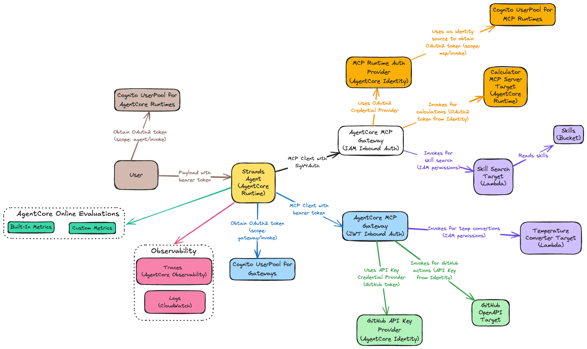

# AgentCore CDK

## Architecture



The diagram shows the complete authentication and data flow, including:
- Cognito UserPools for authentication (Agent Runtimes, Gateways, MCP Runtimes)
- AgentCore MCP Gateways (IAM and JWT authentication)
- AgentCore Identity with OAuth2 and API Key credential providers
- MCP targets (Calculator Runtime, Skill Search Lambda, Temperature Converter Lambda, GitHub OpenAPI)
- Observability components (Traces, Evaluations, CloudWatch Logs)
- Skills S3 bucket

[View editable diagram](./architecture.excalidraw)

## Project Structure

```
.
├── app.py                        # CDK application entry point
├── pyproject.toml                # Python project dependencies
├── Makefile                      # Build, deploy, and test commands
│
├── src/
│   ├── cdk/                      # CDK infrastructure code
│   │   ├── stacks/               # CloudFormation stacks
│   │   │   └── agentcore.py      - Main AgentCore stack (gateways, runtimes, MCP targets)
│   │   ├── constructs/           # Reusable L3 constructs
│   │   │   ├── cognito.py        - Cognito user pools and app clients
│   │   │   ├── gateway.py        - AgentCore Gateways
│   │   │   ├── runtime.py        - AgentCore Runtimes
│   │   │   ├── identity.py       - Credential providers (OAuth2, API keys) in AgentCore Identity
│   │   │   ├── evaluation.py     - Online evaluation configurations for runtime monitoring
│   │   │   ├── bucket.py         - S3 buckets with lifecycle policies (store skills)
│   │   │   └── gateway_targets/  - Gateway target configurations
│   │   │       ├── lambda_.py    - Lambda function targets
│   │   │       ├── mcp_server.py - MCP server targets
│   │   │       └── open_api.py   - OpenAPI targets
│   │   └── utils/                # Utility functions
│   │       ├── cleanup.py        - Log group cleanup aspects and custom resources
│   │       └── strings.py        - Case conversion utilities (kebab/PascalCase/snake_case)
│   │
│   ├── agent/                    # Agent runtime implementation
│   │   ├── main.py               - Agent entrypoint with Bedrock + MCP integration
│   │   ├── pyproject.toml        - Agent dependencies
│   │   └── Dockerfile            - Agent container image
│   │
│   ├── mcp/                      # MCP server implementations
│   │   ├── calculator/           - Basic calculator MCP server (MCP Server Target)
│   │   │   ├── main.py           - FastMCP server with arithmetic tools
│   │   │   ├── pyproject.toml    - Server dependencies (fastmcp)
│   │   │   └── Dockerfile        - Container image for Runtime deployment
│   │   ├── temperature_converter/ - Temperature conversion MCP server (Lambda Target)
│   │   │   ├── main.py           - FastMCP server with temp conversion tools
│   │   │   ├── schema.json       - Schema for Gateway integration
│   │   │   └── Dockerfile        - Container image for Runtime deployment
│   │   ├── skill_search/         - Skill search MCP server (Lambda Target)
│   │   │   ├── main.py           - FastMCP server with skill search tools
│   │   │   ├── schema.json       - Schema for Gateway integration
│   │   │   └── Dockerfile        - Container image for Runtime deployment
│   │   └── github/               - GitHub API MCP server (OpenAPI Target)
│   │       └── schema.json       - GitHub OpenAPI schema for Gateway target
│   │
│   ├── observability/            # Observability setup
│   │   └── setup.sh               - One-time account setup for AgentCore observability (X-Ray tracing)
│   │
│   └── skills/                   # Agent skill definitions
│       ├── issue_heat_map.md
│       ├── portfolio_summary.md
│       ├── repo_comparison.md
│       ├── repo_hotness_rating.md
│       └── trending_topic_scout.md
│
├── layers/                       # Lambda layer source directories
│   └── agentcore_sdk/            - AgentCore Starter Toolkit SDK layer (bundled at deploy time)
│
└── scripts/                      # Testing and invocation scripts
    ├── runtimes/
    │   ├── agent/                # Agent runtime testing
    │   │   ├── invoke_agent.py   - Invoke agent with Oauth2 authentication
    │   │   └── skill_tests/      - Test scripts for each agent skill
    │   └── mcp/                  # MCP runtime testing
    │       └── invoke_calculator.py
    └── gateways/
        ├── iam/                  # IAM-authenticated gateway testing
        │   ├── auth.py           - SigV4 signing helper
        │   ├── list_tools.py     - List available tools
        │   ├── search_tools.py   - Search tools by keyword
        │   ├── invoke_tool.py    - Invoke a specific tool
        │   └── mcp_tests/        - MCP tools tests
        │       ├── calculator.py - Test calculator tools
        │       └── skill_search.py - Test skill search tool
        └── jwt/                  # JWT-authenticated gateway testing
            ├── auth.py           - Cognito authentication helper
            ├── list_tools.py     - List available tools
            ├── search_tools.py   - Search tools by keyword
            ├── invoke_tool.py    - Invoke a specific tool
            └── mcp_tests/        - MCP tools tests
                ├── github.py     - Test GitHub tools
                └── temperature_converter.py - Test temperature converter tools
```

## Prerequisites

- Python 3.12 or higher
- AWS CLI configured with appropriate credentials and an active session
  ```bash
  # Verify your AWS session is active
  aws sts get-caller-identity
  ```
- AWS CDK CLI installed (`npm install -g aws-cdk`)
- AWS account bootstrapped for CDK
  ```bash
  # Bootstrap your AWS account (one-time per account/region)
  cdk bootstrap aws://AWS_ACCOUNT_ID/REGION_NAME
  ```

## Quick Start

### 1. Configure Environment Variables

Copy the example environment file and update it with your values:

```bash
cp .env.example .env
```

Edit `.env` and set:
- `AWS_ACCOUNT_ID` - Your AWS account ID (e.g., `123456789012`)
- `REGION_NAME` - AWS region where resources will be deployed (e.g., `ap-southeast-2`)
- `GITHUB_TOKEN` - Your GitHub personal access token (for GitHub MCP server)

> **Note**: The observability setup script and CDK deployment will use the account and region from your `.env` file.

### 2. Install Dependencies

```bash
make install
```

This will:
- Check that Python 3.12+ is installed (works with both `python` and `python3` commands)
- Create a virtual environment in `.venv`
- Install all project dependencies

### 3. Activate Virtual Environment

```bash
source .venv/bin/activate
```

### 4. Enable Observability (One-Time Account Setup)

**Required once per AWS account** to enable X-Ray tracing and CloudWatch Transaction Search for AgentCore:

```bash
make setup-observability
```

This configures:
- CloudWatch Logs resource policy for X-Ray
- X-Ray trace segment destination
- Sampling rules for trace collection

> **Note**: This is a one-time setup per AWS account and region. The script is idempotent and safe to run multiple times.

### 5. Deploy Infrastructure

Deploy the AgentCore stack:

```bash
make deploy
```

This will deploy the AgentCore stack with all gateways, runtimes, and MCP servers.

### 6. Run Tests

```bash
make skill-tests               # Run all agent skill tests
make iam-tests                 # Run all IAM gateway tests
make jwt-tests                 # Run all JWT gateway tests
```

## Cleanup

To destroy the deployed infrastructure:

```bash
make destroy
```

**Note**: Destroying the stack will permanently delete all resources.

## Available Commands

All deployment, testing, and invocation commands are available through the Makefile. For the complete list:

```bash
make help
```

For the complete list of commands and detailed usage, run `make help` or see the **[Makefile](Makefile)**.
